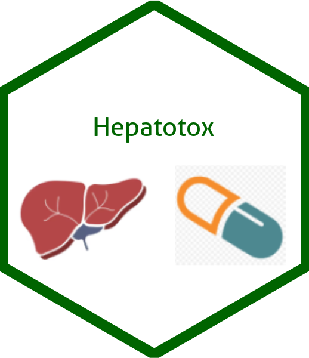

## {width="130"}

### [Hepatotox Catalog]{style="color:blue;"}

The catalog is a series of outputs for a Stage 1 Hepatotoxicity white paper considering a set of aggregate analyses and displays to rule out potential drug-induced liver injury (DILI). The catalog was generated using TERN and random.cdisc.data packages.

This repository provides a collection of hepatotoxicity-related analyses and outputs generated using the R language. The target audience is the clinical trials community, including statisticians, data scientists, and other professionals interested in applying R to clinical trials data.

### [Shiny App Demo]{style="color:blue;"}

The following is an output comparing maximum total bilirubin vs. maximum other liver enzymes (ALT, AST, or ALP). Interact with the Shiny App directly below:

::: {style="text-align:center;"}
<iframe src="https://rxu6nu-dimple-patel.shinyapps.io/App1/" width="100%" height="600px" style="border:none;">

</iframe>
:::

### [Usage]{style="color:blue;"}

Setup and pre-processing of synthetic data.

-   Code to produce the output.

-   The output generated by the given code.

-   An interactive application that can alternatively be used to produce and interact with the graph.

See the full list of available outputs on the Index page.

### [Interacting with Catalog R Code]{style="color:blue;"}

The full source code of each article can be viewed by clicking on the “Source Code” button at the top of the page and copied using the “Copy to Clipboard” button.

Individual code chunks from within the article can also be viewed and copied. The Reproducibility tab contains session information and allows one to install the packages required to properly run the code.

### [License]{style="color:blue;"}

This catalog as well as code examples are licensed under the Apache License, Version 2.0 - see the LICENSE file for details.

### [Contributing]{style="color:blue;"}

We welcome contributions big and small to the TLG catalog. Please refer to the Contributing guide for more information on how you can contribute.

### [Development]{style="color:blue;"}

This website is built using Quarto and hosted on GitHub Pages.
